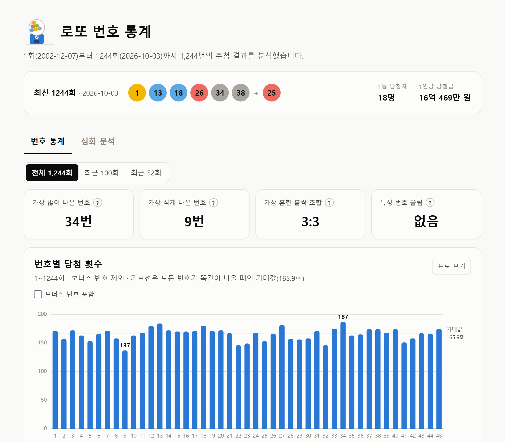
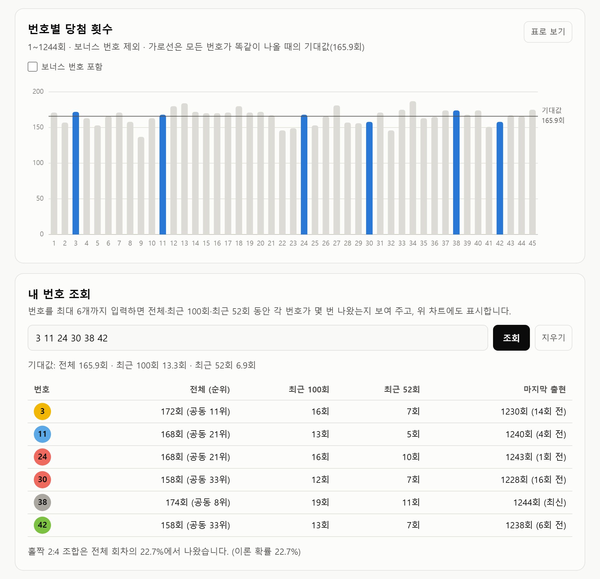
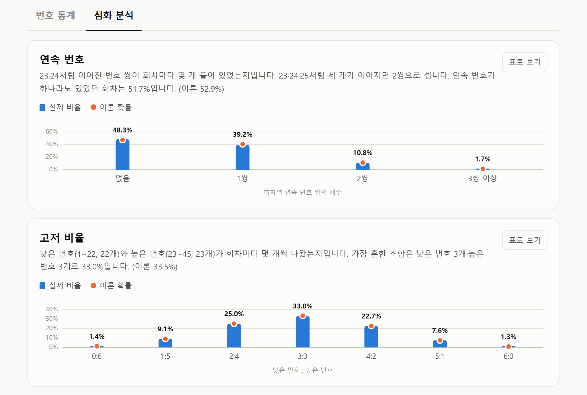
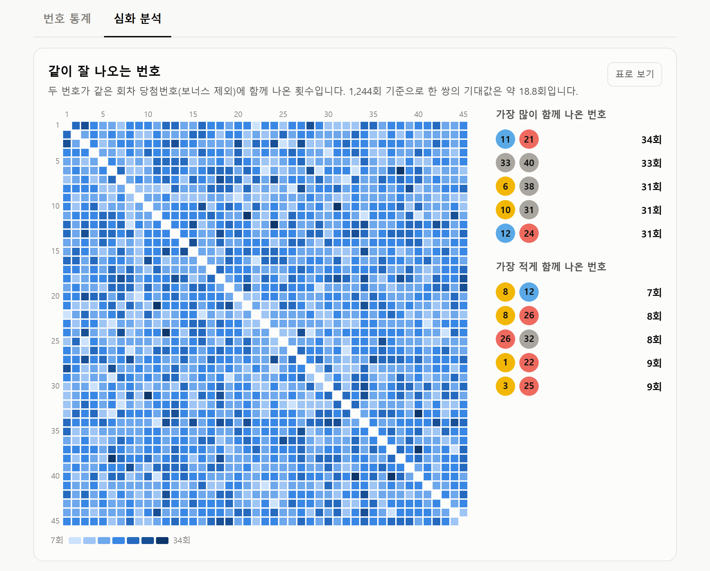
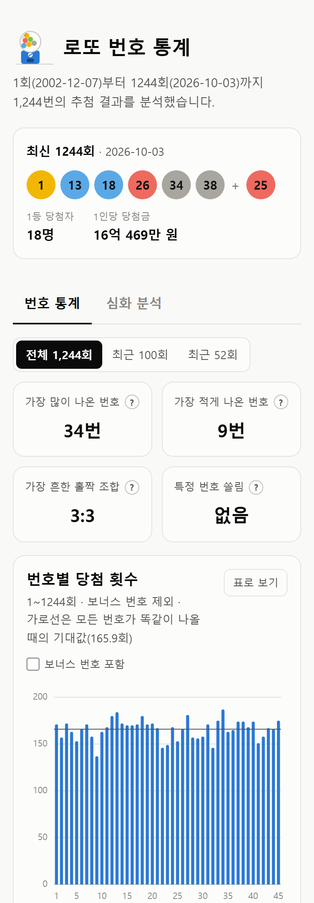
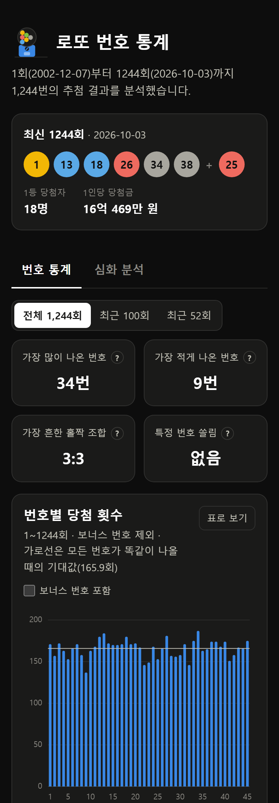
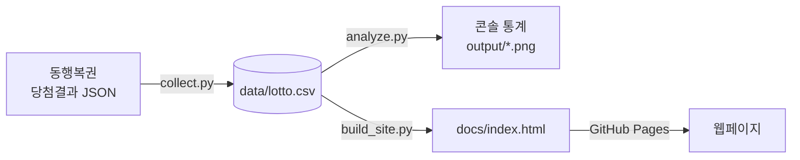
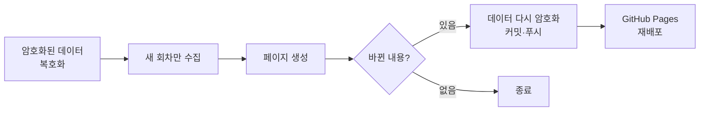

# 로또 6/45 번호 통계

동행복권 로또 6/45의 1회부터 최신 회차까지 당첨번호를 수집해 번호별 출현 빈도, 홀짝·고저 비율, 연속 번호, 끝수, 이월수,
함께 나온 번호 쌍 등을 이론 확률과 비교 분석하고, 그 결과를 웹페이지로 보여줍니다.
매주 GitHub Actions가 새 회차를 자동으로 반영합니다.

**웹페이지: [pcw7.github.io/lotto-stats](https://pcw7.github.io/lotto-stats/)**

<picture>
  <source media="(prefers-color-scheme: dark)" srcset="screenshots/page-dark.png">
  
</picture>

<sub>화면은 1244회 기준입니다. 최신 결과는 웹페이지에서 볼 수 있습니다.</sub>

## 웹페이지 기능

페이지 위쪽에는 **최신 회차** 당첨번호와 1등 당첨자 수, 1인당 당첨금이 항상 보이고, 아래는 탭 2개로 나뉩니다.
심화 분석 탭은 주소 끝에 `#more`를 붙이면 바로 열립니다.

### 번호 통계 탭

전체·최근 100회·최근 52회(약 1년) 중 기간을 고르면 탭 안의 통계가 모두 그 기간 기준으로 바뀝니다.

- **요약 지표**: 가장 많이·적게 나온 번호, 가장 흔한 홀짝 조합, 특정 번호 쏠림(카이제곱 검정) 여부를 보여줍니다. 제목 옆 **?** 에 마우스를 올리거나 누르면 숫자의 근거를 자세히 풀어 설명합니다.
- **번호별 당첨 횟수**: 1~45번의 당첨 횟수를 기대값 기준선과 함께 보여줍니다. 막대에 마우스를 올리면 횟수가 나오고, 표로도 볼 수 있습니다. **보너스 번호 포함**을 켜면 보너스로 나온 횟수를 막대 위에 쌓아 보여줍니다.
- **홀짝 조합**: 회차별 홀수·짝수 조합의 실제 비율을 이론 확률(초기하분포)과 비교합니다.
- **내 번호 조회**: 번호를 입력하면 전체·최근 100회·최근 52회 당첨 횟수, 전체 순위, 마지막 출현 회차를 한 표로 보여주고, 위 차트에서 그 번호만 강조합니다.
- **오래 안 나온 번호**: 최신 회차 기준으로 가장 오래 나오지 않은 번호 5개를 보여줍니다.



### 심화 분석 탭

전체 회차 기준입니다. 번호 패턴 차트는 막대가 실제 비율, 점이 이론 확률이며 모두 표로도 볼 수 있습니다.

- **번호 합계와 번호대**: 번호 6개 합계의 분포와 1\~10·11\~20 등 번호대별 비율을 이론 확률과 비교합니다. 합계의 이론 확률은 가능한 조합 8,145,060개를 모두 세어 계산합니다.
- **연속 번호**: 23·24처럼 이어진 번호 쌍이 회차마다 몇 개였는지 이론 확률과 비교합니다. 연속 쌍이 s개인 조합 수는 C(5, s) × C(40, 6 − s)로 계산합니다.
- **고저 비율**: 낮은 번호(1\~22)와 높은 번호(23\~45)가 회차마다 몇 개씩 나왔는지 이론 확률(초기하분포)과 비교합니다.
- **끝수(끝자리)**: 끝자리 0~9의 비율과, 회차마다 6개 번호의 끝자리가 몇 가지였는지를 이론 확률과 비교합니다.
- **이월수와 이웃수**: 직전 회차 당첨번호가 다시 나온 개수와, 직전 번호의 ±1이 나온 개수를 이론 확률과 비교합니다.
- **연도별 추이**: 1등 1인당 평균 당첨금, 회당 평균 1등 당첨자 수, 회당 평균 판매액을 연도 축을 공유하는 차트 3개로 보여줍니다.
- **누적 기록**: 1회부터 지금까지의 총 판매액, 1등 당첨자 수, 1등 1인당 평균 당첨금(1등 당첨금 총액 ÷ 당첨자 수)을 보여줍니다.
- **역대 기록**: 1등 1인당 최고·최저 당첨금, 1등 최다 당첨자, 최고 판매액, 이월 횟수, 번호별 최장 미출현 기록을 보여줍니다.
- **같이 잘 나오는 번호**: 두 번호가 같은 회차에 함께 나온 횟수를 45×45 히트맵으로 보여주고, 가장 많이·적게 함께 나온 번호 쌍을 정리합니다.

<picture>
  <source media="(prefers-color-scheme: dark)" srcset="screenshots/more-dark.png">
  
</picture>

<picture>
  <source media="(prefers-color-scheme: dark)" srcset="screenshots/pairs-dark.png">
  
</picture>

### 그 밖에

제목 옆 **가챠 추첨기**를 누르면 손잡이가 돌고 구슬이 섞인 뒤 하나가 굴러 나옵니다. 다크 모드와 모바일 화면을 지원합니다.

<table>
  <tr>
    <td align="center"></td>
    <td align="center"></td>
  </tr>
  <tr>
    <td align="center">모바일</td>
    <td align="center">모바일 다크 모드</td>
  </tr>
</table>

## 분석 결과 (1~1243회 기준)

| 항목 | 결과 |
|---|---|
| 가장 많이 나온 번호 | 34번 (186회) |
| 가장 적게 나온 번호 | 9번 (137회) |
| 번호당 기대값 | 165.7회 |
| 카이제곱 검정 | 29.3 (자유도 44, 유의수준 5%의 기준값 60.48보다 작음) |
| 가장 흔한 홀짝 조합 | 3:3 (33.3%, 이론 확률 33.5%) |
| 가장 많이 함께 나온 번호 쌍 | 11·21 (34회, 한 쌍의 기대값 18.8회) |

가장 많이 나온 번호와 가장 적게 나온 번호는 49회 차이가 나서 커 보이지만, 카이제곱 검정으로 보면 무작위 추첨에서 자연스럽게 생기는 정도의 차이입니다.

번호 패턴도 실제 비율이 이론 확률과 거의 같습니다. 차트의 모든 구간을 비교해도 가장 큰 차이가 2.2%p(합계 141~160)입니다.

| 패턴 | 실제 | 이론 |
|---|---|---|
| 번호 6개 합계의 평균 | 138.3 | 138 |
| 연속 번호가 하나라도 있는 회차 | 51.7% | 52.9% |
| 가장 흔한 고저 조합 (낮은 번호 3개·높은 번호 3개) | 33.0% | 33.5% |
| 끝자리가 같은 번호가 있는 회차 | 78.1% | 79.0% |
| 직전 회차 번호가 1개 이상 다시 나온 회차 (이월수) | 61.4% | 59.9% |
| 직전 번호의 ±1이 1개 이상 나온 회차 (이웃수) | 77.6% | 78.7% |

이론 확률은 공식으로 계산하고, 가능한 조합 8,145,060개를 모두 세어 보거나 모의실험을 돌려 맞는지 확인했습니다.
매 회차 추첨은 이전 결과와 상관없이 독립적이므로, 과거 출현 빈도나 패턴으로 다음 당첨번호를 예측할 수는 없습니다.

## 동작 방식



매주 일요일 07:43(한국 시간)에는 GitHub Actions가 같은 과정을 자동으로 실행합니다.
GitHub 예약 실행은 늦어지거나 건너뛰어질 수 있어서, 같은 날 19:43에 한 번 더 확인합니다. 이미 반영됐으면 커밋하지 않습니다.



## 직접 실행

```bash
pip install -r requirements.txt
python collect.py      # 당첨번호 수집 → data/lotto.csv (이미 받은 회차는 건너뜀)
python analyze.py      # 분석 결과 출력 + 차트 → output/
python build_site.py   # 웹페이지 생성 → docs/index.html
```

## 자동 갱신

워크플로는 [`.github/workflows/update-lotto.yml`](.github/workflows/update-lotto.yml)에 있습니다.
레포의 **Actions 탭 → 로또 통계 갱신 → Run workflow**로 바로 실행할 수도 있습니다.

- 동행복권은 해외 IP(GitHub 서버)의 연속 요청을 막습니다. 그래서 지난 데이터를 암호화한 `lotto.csv.enc`를 레포에 보관하고, Actions는 이를 복호화한 뒤 새 회차만 받습니다. (요청 1~2번)
- 암호 키는 레포 Settings → Secrets의 `LOTTO_DATA_KEY`에 있습니다. 원본 데이터는 공개되지 않습니다.
- Actions가 커밋을 추가하므로, 로컬에서 작업하기 전에 `git pull`을 먼저 하세요. `docs/`와 `lotto.csv.enc`는 Actions가 관리하므로 로컬에서 커밋하지 않습니다.
- 키를 바꾸거나 잃어버렸다면, 로컬에서 `collect.py`로 데이터를 최신으로 맞춘 뒤 새 키를 만들어 `LOTTO_DATA_KEY` 환경 변수로 `python data_crypt.py encrypt`를 실행하고, 같은 키를 `gh secret set LOTTO_DATA_KEY`로 등록한 다음 `lotto.csv.enc`를 커밋하세요.

### 수집 안전장치

`collect.py`는 실행할 때마다(자동 갱신, 직접 실행 모두) 아래를 확인하고, 하나라도 걸리면 **데이터를 요청하지 않고 멈춥니다.** 자동 갱신에서 멈추면 GitHub이 실패 알림 메일을 보내고, 웹페이지는 마지막 정상 상태로 남습니다.

| 확인 | 걸리면 |
|---|---|
| robots.txt에서 데이터 주소가 금지됨 | 멈춤 |
| robots.txt를 읽지 못함 | 멈춤 |
| robots.txt가 마지막으로 확인한 내용(`robots_snapshot.txt`)과 다름 | 멈춤. 바뀐 부분을 보여줍니다 |
| 최신 회차 추첨일로부터 8일이 지났는데 새 회차가 없음 | 실패로 알림 (조용히 멈춰 있는 경우를 잡기 위해) |

robots.txt가 바뀌어 멈췄다면 바뀐 내용을 직접 확인하고, 문제가 없을 때만 아래 명령으로 저장본을 갱신한 뒤 `robots_snapshot.txt`를 커밋하세요. 이 명령은 데이터를 수집하지 않습니다.

```bash
python collect.py --accept-robots
```

## 파일 구조

| 파일 | 내용 |
|---|---|
| `collect.py` | 동행복권에서 당첨번호를 수집해 CSV로 저장 |
| `analyze.py` | 분석 함수 모음 (출현 빈도, 홀짝, 합계, 연속 번호, 고저, 끝수, 이월수·이웃수, 번호 쌍, 연도별 추이, 역대 기록)과 이론 확률 계산. 직접 실행하면 빈도·홀짝·오래 안 나온 번호를 출력하고 차트(`output/*.png`)를 만듭니다 |
| `build_site.py` | 기간별(전체, 최근 100회, 최근 52회) 집계 결과를 `site_template.html`에 넣어 웹페이지(`docs/index.html`) 생성. 원본 데이터는 넣지 않습니다 |
| `site_template.html` | 웹페이지 틀 (HTML, CSS, 자바스크립트 차트) |
| `data_crypt.py` | 수집 데이터를 암호화·복호화 (자동 갱신용) |
| `lotto.csv.enc` | 암호화된 수집 데이터. 키가 없으면 읽을 수 없습니다 |
| `robots_snapshot.txt` | 마지막으로 직접 확인한 동행복권 robots.txt. 수집 전에 지금 내용과 비교합니다 |
| `data/lotto.csv` | 수집한 데이터 (회차, 추첨일, 번호 6개, 보너스, 1등 당첨자 수·당첨금, 총판매금액). 레포에는 포함하지 않습니다 |
| `docs/` | GitHub Pages로 공개되는 웹페이지 |
| `screenshots/` | README용 웹페이지 화면 |

## 기술 스택

- **수집·분석**: Python, requests, pandas, matplotlib
- **웹페이지**: HTML, CSS, 자바스크립트 (SVG로 직접 그린 차트, 외부 라이브러리 없음)
- **자동화·배포**: GitHub Actions, GitHub Pages, cryptography (데이터 암호화)
